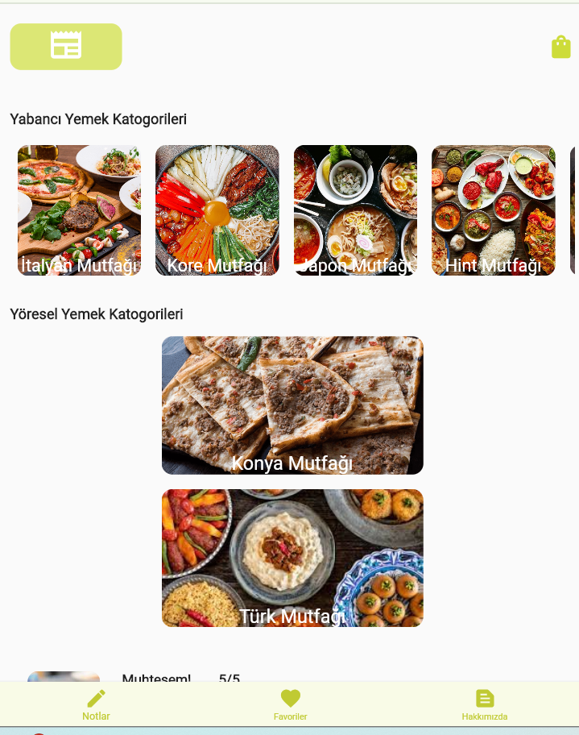

# Yemekcii - Flutter Yemek Sipariş ve Keşif Uygulaması

Yemekcii, Flutter ile geliştirilen, Firebase ve SQLite tabanlı modern bir yemek sipariş ve keşif uygulamasıdır.  
Kullanıcıların güvenli bir şekilde kayıt olması, giriş yapması, ürünleri keşfetmesi, sepetine ürün eklemesi, favori listesine ürün eklemesi gibi birçok özelliği destekler.  
Ayrıca ürün detaylarını görüntüleme, harici link açma ve uygulama içi slider gibi kullanıcı dostu fonksiyonlar sunar.

---


## Uygulama Ekran Görüntüleri

<p align="center">
  
  
  
</p>

---

## Özellikler

- **Kullanıcı Kaydı ve Girişi**  
  Firebase Authentication ile e-posta ve şifre kullanarak güvenli kullanıcı yönetimi.

- **Ürün Listeleme ve Keşfetme**  
  Firestore'dan anlık veri çekimi ile ürünleri ve içerikleri görüntüleyip keşfetme.

- **Sepet Yönetimi (Offline Destekli)**  
  SQLite kullanılarak çevrimdışı ve çevrimiçi modda ürünleri sepete ekleme ve yönetme.

- **Favorilere Ekleme**  
  Beğenilen ürünleri favorilere ekleyerek kolay erişim.

- **Carousel Slider ile Ürün Tanıtımı**  
  Popüler yemekleri ve fırsatları slider ile tanıtma.

- **Harici Linklerle Ürün Tanıtımı**  
  Ürün detaylarından harici site ve bağlantılara yönlendirme (URL Launcher).

- **HTTP API Kullanımı**  
  Dış kaynaklardan veri alma ve işleme (örneğin öneri sistemi, ürün yorumları).

- **Responsive ve Modern Arayüz**  
  Tüm ekran boyutlarına uyumlu modern ve kullanıcı dostu tasarım.

---

## Kullanılan Teknolojiler ve Kütüphaneler

| Teknoloji | Açıklama |
|-----------|----------|
| Flutter | Mobil uygulama geliştirme framework'ü |
| Firebase Authentication | Kullanıcı kimlik doğrulama |
| Cloud Firestore | Gerçek zamanlı NoSQL veritabanı |
| Firebase Storage | Ürün ve içerik görselleri için dosya depolama |
| SQLite (sqflite) | Yerel veritabanı ve çevrimdışı sepet yönetimi |
| HTTP | Harici API'lerden veri alma |
| Carousel Slider | Ürünler ve banner'lar için slider |
| URL Launcher | Harici bağlantı ve site açma |
| Path | Dosya yolu yönetimi |

---

## Kurulum ve Çalıştırma

1. Repository'yi klonlayın:
    ```bash
    git clone <repo-link>
    cd yemekcii
    ```

2. Flutter bağımlılıklarını yükleyin:
    ```bash
    flutter pub get
    ```

3. Firebase kurulumu:
    - Firebase projenizi oluşturun.
    - `google-services.json` dosyasını `android/app` dizinine ekleyin.
    - `GoogleService-Info.plist` dosyasını `ios/Runner` dizinine ekleyin.

4. Firestore'da `products` koleksiyonu ve gerekli dökümanları oluşturun.

5. Uygulamayı başlatın:
    ```bash
    flutter run
    ```

---

## Modüller ve Özellik Detayları

### 1. Kullanıcı Yönetimi
- Firebase Authentication ile kullanıcı kayıt ve giriş işlemleri.
- Oturum yönetimi ve kullanıcı bilgisi güncelleme.

### 2. Ürün Yönetimi ve Listeleme
- Firestore'dan dinamik ürün listesi.
- Ürün adı, açıklaması, fiyatı ve resmi.
- Carousel slider üzerinden ürün tanıtımı.

### 3. Sepet ve Favoriler
- Ürünleri sepete ekleme, çıkarma, güncelleme.
- SQLite kullanarak çevrimdışı destekli sepet yönetimi.
- Favorilere ekleme ve favoriler ekranında listeleme.

### 4. API ve Harici Servisler
- HTTP ile öneri ürün sistemine API bağlantısı.
- URL Launcher ile ürün detaylarından harici sitelere yönlendirme.

---

---

## Gereksinimler

- Flutter 3.x veya üstü (>=2.19.4 <3.0.0)
- Android Studio / VSCode
- Firebase hesabı

---

